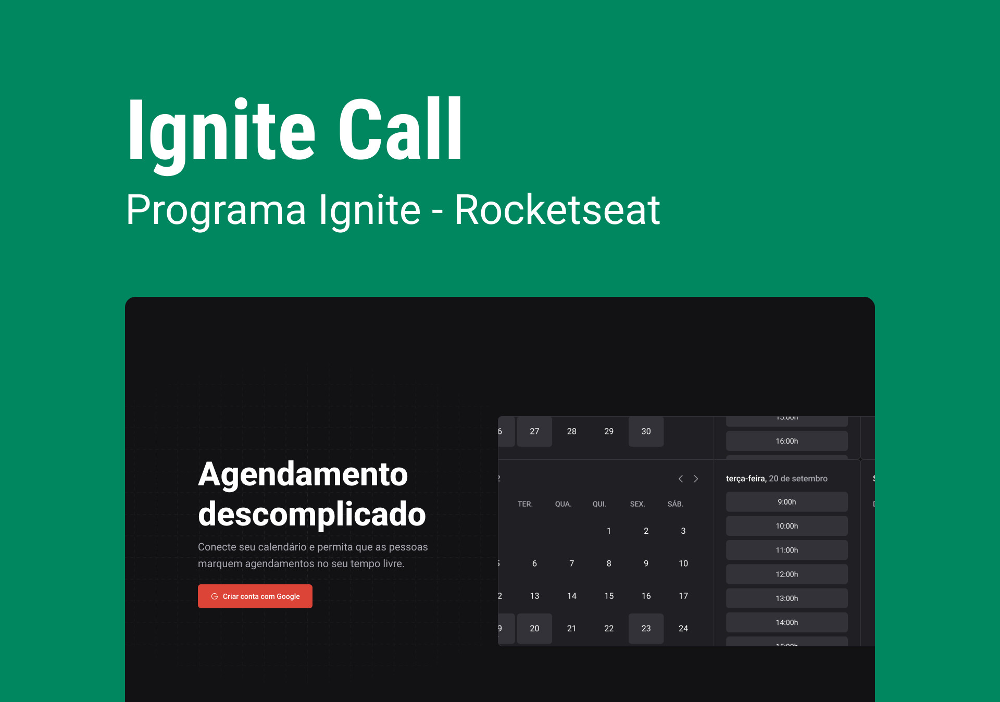

<h1 align="center">Ignite Call</h1>

Erick Marques Cabral

Esse projeto exclusivo e gratuito, promovido pela Rocketseat para ensino de tecnologias WEB.  
<a href="https://www.rocketseat.com.br/">Rocketseat🔗</a>.

  

  <a href="#-descrição">Descrição do Projeto</a>&nbsp;&nbsp;&nbsp;|&nbsp;&nbsp;&nbsp;
  <a href="#-tecnologias">Tecnologias</a>&nbsp;&nbsp;&nbsp;|&nbsp;&nbsp;&nbsp;
  <a href="#-layout">Layout</a> 

  

## 💻 Descrição
Nesse projeto, desenvolvi uma aplicação completa para meu portifólio, que contém as seguintes funcionalidades:

- Fazer login com a conta do Google.
- O usuário disponibiliza dias e horários para agendamento.
- Realizar a marcação na agenda do Google.
- Enviar notificação aos usuários envolvidos.

Apesar de serem poucas funcionalidades, precisei abordar conceitos como:

- Estados
- Imutabilidade do estado
- Listas e chaves no ReactJS
- Propriedades
- Componentização
- Consumo de API e credenciais do Google
- Cookies
- Formulários

## 🚀 Tecnologias
Esse projeto foi desenvolvido com as seguintes tecnologias:

- HTML e CSS
- JavaScript
- Git e Github
- Figma
- Next.JS
- TypeScript
- ReactJS
- Prisma (ADAPTER)
- oAuth
- Zood

    
## 🔖 Layout

Você pode visualizar o layout do projeto através [DESSE LINK](https://www.figma.com/file/hRlkN6MBTit4bBWQt3HQyn/Ignite-Call?node-id=339%3A74&t=v4AGJOMRFhCm4SRc-1). É necessário ter conta no [Figma](https://figma.com) para acessá-lo.
